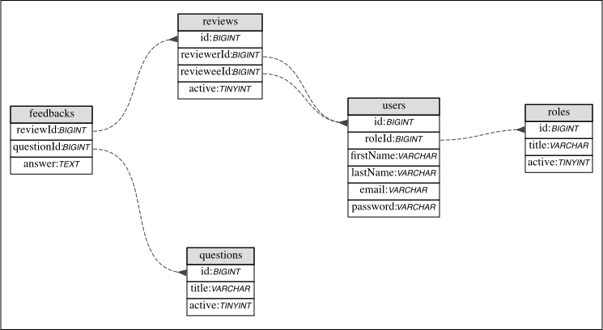

# Awesome Reviews 😎

A MVP of a dashboard for creating Performance Reviews in a corporation.

## Features ⚙️

- Admin
  - CRUD employees
  - CRUD performance reviews
- Employee
  - View/Submit assigned reviews

## Tools 🧰

- Client Side

  - [React](https://reactjs.org/)
  - [Next.js](https://nextjs.org/)
  - [Chakra UI](https://next.chakra-ui.com/)

- Server Side
  - [Next.js](https://nextjs.org/)
  - [MySQL](https://www.mysql.com/)

Writen in [TypeScript](https://www.typescriptlang.org/) flavor.

## Entity Relationship Diagram



## How to Run 💻

You should create an `.env` file with the following and change `${CHANGE_ME}` to your own configuration:

```
MYSQL_HOST=${CHANGE_ME}
MYSQL_PORT=${CHANGE_ME}
MYSQL_DATABASE=${CHANGE_ME}
MYSQL_USER=${CHANGE_ME}
MYSQL_PASSWORD=${CHANGE_ME}
```

The SQL to create the tables is [awesome_reviews.sql](awesome_reviews.sql), be sure to run it before any of the next steps.

Also you need to install `npm` modules with:

```
$ npm install
```

### Development 🚧

```
$ npm run dev
```

### Production 🏢

```
$ npm run build
```

```
$ npm start
```

## TODO ✅

### General

- [ ] Use better auth
  - JWT is a good option. It can help both sides.
- [ ] Check errors in both sides.
  - As an MVP, the assumption is happy path for most of the actions.
- [ ] Use RBAC (Roles Based Access Control)
  - That way is easy to extend the permissions from all users.

### Client Side

- [ ] Route guards
  - An `employee` shouldn't be able to access `admin` routes.
- [ ] Write tests
  - [Cypress](https://www.cypress.io/) for E2E and [React Testing Library](https://github.com/testing-library/react-testing-library)

### Server Side

- [ ] Encrypt passwords
  - Plain passwords aren't good for production :)
- [ ] Use Database transactions
  - We need to ensure our data is always correct
- [ ] Route guards
  - With JTW we could ensure that only proper users can access our endpoints
- [ ] Use Types
  - Not neccesary on the MVP because of the happy path. But it could improve DX.
